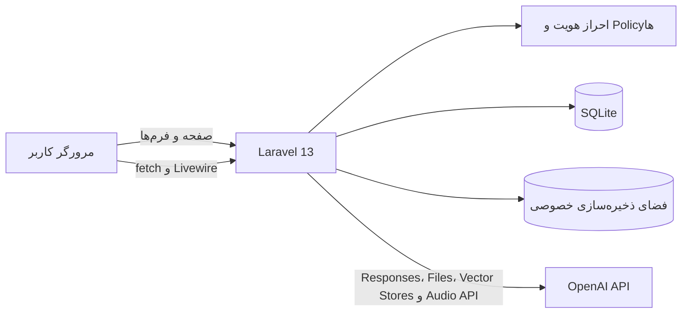
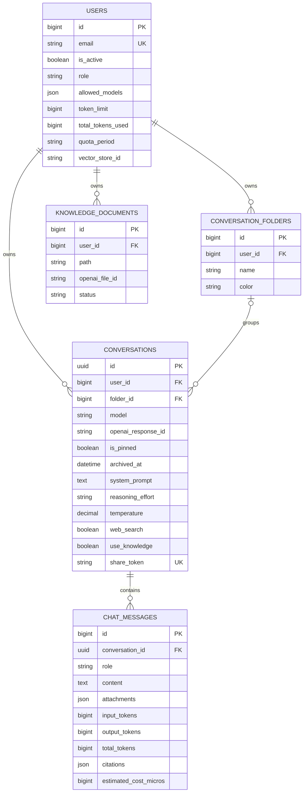
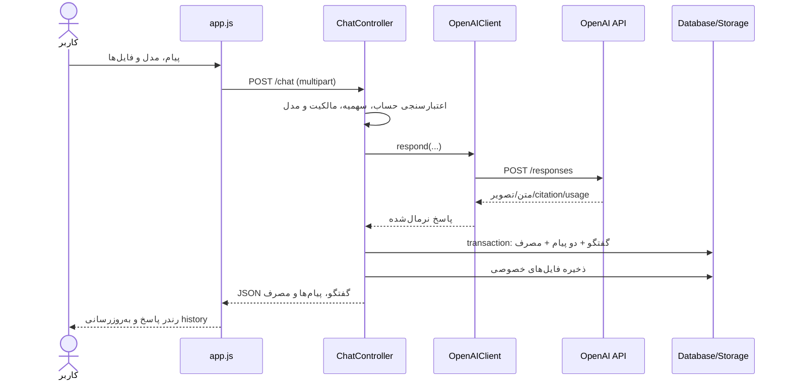
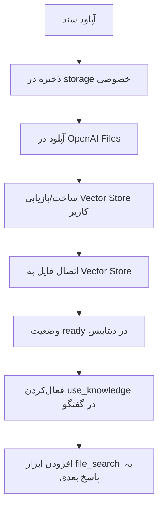

# معماری و عملکرد پروژه «گپ»

این سند نمای فنی پروژه، مسئولیت اجزا و جریان‌های اصلی اجرای برنامه را بر اساس وضعیت کد در ۱ اوت ۲۰۲۶ شرح می‌دهد. برای امکانات قابل‌مشاهده، نصب سریع و تنظیمات عمومی به [README](README.md) مراجعه کنید؛ این سند بیشتر بر معماری داخلی و نحوه همکاری اجزا تمرکز دارد.

## ۱. نمای کلی

«گپ» یک کلاینت چت فارسی و راست‌چین برای OpenAI است. برنامه یک Laravel monolith است: احراز هویت، APIهای داخلی، مدیریت گفتگو، پنل مدیر و ارتباط با OpenAI همگی در Laravel قرار دارند. رابط با Blade و Tailwind CSS رندر می‌شود، JavaScript ساده تعاملات چت را انجام می‌دهد و Livewire فقط تاریخچه و پوشه‌های گفتگو را مدیریت می‌کند.



معماری در یک نگاه:

- Backend: PHP 8.5 و Laravel 13
- UI: Blade، Tailwind CSS 4، Vite 8 و JavaScript بدون framework
- بخش reactive: Livewire 4 برای sidebar گفتگوها
- دیتابیس پیش‌فرض: SQLite
- تست: Pest 4 روی PHPUnit 12
- سرویس هوش مصنوعی: OpenAI Responses API و APIهای Files، Vector Stores و Audio
- ذخیره فایل: دیسک خصوصی `local`

## ۲. نقشه ساختار پروژه

```text
app/
├── Console/Commands/          فرمان ساخت کاربر مدیر
├── Exceptions/                خطاهای پیکربندی و پاسخ OpenAI
├── Http/
│   ├── Controllers/           ورودی‌های HTTP و هماهنگی use caseها
│   │   ├── Admin/             پنل مدیریت کاربران و مصرف
│   │   └── Auth/              ثبت‌نام، ورود، تأیید ایمیل و بازیابی رمز
│   ├── Middleware/            کنترل فعال‌بودن حساب و دسترسی مدیر
│   └── Requests/              اعتبارسنجی و authorization ورودی‌ها
├── Livewire/                  sidebar جستجو و پوشه‌بندی گفتگوها
├── Models/                    مدل‌های Eloquent و روابط داده
├── Policies/                  کنترل مالکیت گفتگو، پوشه و سند
└── Services/                  OpenAIClient و مدیریت owner token

bootstrap/app.php              ثبت routeها، middleware aliasها و پاسخ JSON خطاها
config/services.php            مدل‌ها، قیمت تقریبی و تنظیمات OpenAI
database/
├── factories/                 داده‌سازهای تست
├── migrations/                schema دیتابیس
└── seeders/                   داده‌های نمونه
resources/
├── css/app.css                استایل‌های Tailwind و اجزای رابط
├── js/app.js                  منطق مرورگر و چرخه تعاملی چت
└── views/                     صفحه چت، auth، admin، public و export
routes/web.php                 تمام ۳۴ route وب برنامه
tests/Feature/                 تست رفتارهای اصلی برنامه
docker/                        entrypoint، PHP و Caddy
```

## ۳. لایه‌ها و مسئولیت‌ها

### Route و Middleware

تمام routeهای برنامه در `routes/web.php` تعریف شده‌اند. routeهای مهم در سه محدوده قرار می‌گیرند:

1. `guest`: ثبت‌نام، ورود و بازیابی رمز عبور.
2. `auth`: خروج و تأیید ایمیل.
3. `auth + active + verified`: چت، گفتگوها، فایل‌ها، دانش، صوت و پنل مدیر.

Middleware سفارشی `active` حساب غیرفعال را متوقف می‌کند و `admin` دسترسی پنل مدیریت را محدود می‌سازد. عملیات حساس علاوه بر middleware، از Form Request، Policy یا بررسی صریح مالکیت استفاده می‌کنند. routeهای ورود، چت، فایل، دانش، صوت و اشتراک عمومی rate limit دارند.

### Controllerها

| جزء | مسئولیت |
|---|---|
| `ChatPageController` | آماده‌سازی صفحه، مدل‌های مجاز، مصرف، اسناد و گفتگوی اولیه |
| `ChatController` | اعتبارسنجی سهمیه و مدل، فراخوانی OpenAI، ذخیره پیام‌ها و به‌روزرسانی مصرف |
| `ConversationController` | برگرداندن یک گفتگو و پیام‌های آن به‌صورت JSON |
| `ConversationManagementController` | نام، تنظیمات، پوشه، pin، archive، share، export و delete |
| `ChatAttachmentController` | نمایش یا دانلود امن پیوست خصوصی |
| `KnowledgeDocumentController` | افزودن/حذف سند محلی و همگام‌سازی آن با OpenAI |
| `SpeechController` | ارسال صوت به سرویس transcription |
| `PublicConversationController` | نمایش فقط‌خواندنی گفتگو از طریق share token |
| `Admin\\UserController` | آمار کل، نمودار مصرف و تنظیم حساب/سهمیه |

### سرویس‌ها

`OpenAIClient` مرز اصلی ارتباط خارجی است و این عملیات را پیاده‌سازی می‌کند:

- تولید پاسخ با `POST /responses`
- آپلود سند با `POST /files`
- ساخت و تکمیل Vector Store
- حذف فایل از OpenAI
- تبدیل گفتار با `POST /audio/transcriptions`

درخواست‌ها `connectTimeout=10s` و `timeout=180s` دارند و با تأخیرهای ۲۰۰ و ۵۰۰ میلی‌ثانیه retry می‌شوند. پاسخ‌های Responses API، `output_text` سطح بالا، refusal و پاسخ سازگار با Chat Completions قابل استخراج‌اند.

`ChatOwner` یک UUID دائمی در cookie با نام `chat_owner_token` نگه می‌دارد. این سازوکار برای انتقال گفتگوهای قدیمی بدون حساب به اولین حساب واردشده باقی مانده است؛ گفتگوهای جدید فقط برای کاربر احراز هویت‌شده ساخته می‌شوند.

### مدل‌ها

| مدل | نقش و روابط |
|---|---|
| `User` | مالک گفتگوها، پوشه‌ها و اسناد؛ نگهدارنده نقش، مدل‌های مجاز و شمارنده سهمیه |
| `Conversation` | UUID، تنظیمات مستقل چت و رابطه `belongsTo User/Folder` و `hasMany Messages` |
| `ChatMessage` | پیام کاربر/دستیار، پیوست، citation، مصرف توکن و هزینه تقریبی |
| `ConversationFolder` | پوشه شخصی کاربر با چند گفتگو |
| `KnowledgeDocument` | متادیتای فایل محلی و شناسه فایل OpenAI |

`ChatMessage::toChatArray()` مسیر واقعی فایل را از خروجی حذف و آن را با URL کنترل‌شده دانلود جایگزین می‌کند؛ بنابراین مسیر خصوصی storage به مرورگر نشت نمی‌کند.

## ۴. مدل داده



نکات کلیدی schema:

- حذف کاربر، گفتگوها، پوشه‌ها و اسناد وابسته را cascade می‌کند.
- حذف پوشه، گفتگو را حذف نمی‌کند و فقط `folder_id` را `null` می‌سازد.
- حذف گفتگو، پیام‌ها را از دیتابیس cascade و پوشه فایل همان گفتگو را از storage حذف می‌کند.
- `share_token` یکتا است و تا وقتی `shared_at` مقدار نداشته باشد، گفتگو عمومی نیست.
- هزینه در `estimated_cost_micros` نگهداری می‌شود؛ محاسبه از تعداد توکن و جدول قیمت `config/services.php` است.

## ۵. جریان اصلی ارسال پیام



جزئیات این چرخه:

1. مرورگر پیام را خوش‌بینانه نمایش و `FormData` را ارسال می‌کند.
2. `SendChatMessageRequest` متن، مدل، حالت و فایل‌ها را اعتبارسنجی می‌کند.
3. کاربر و دوره سهمیه refresh می‌شوند؛ حساب غیرفعال، سهمیه تمام‌شده و مدل غیرمجاز متوقف می‌شوند.
4. اگر `conversation_id` وجود داشته باشد، گفتگو فقط میان گفتگوهای همان کاربر جستجو می‌شود.
5. payload OpenAI شامل مدل، instruction، input و reasoning است. در صورت فعال‌بودن تنظیمات گفتگو، temperature، web search، file search یا image generation افزوده می‌شود.
6. برای ادامه context، آخرین `openai_response_id` گفتگو با نام `previous_response_id` ارسال می‌شود.
7. بعد از موفقیت OpenAI، یک transaction گفتگو را در صورت نیاز می‌سازد، پیام کاربر و دستیار را ثبت می‌کند، شناسه پاسخ را به‌روز می‌کند و شمارنده‌های کاربر را افزایش می‌دهد.
8. پاسخ JSON شامل نسخه امن پیام‌ها، اطلاعات گفتگو و مصرف جدید است.

این برنامه streaming واقعی از OpenAI ندارد. پاسخ کامل ابتدا در سرور دریافت می‌شود و سپس JavaScript متن نهایی را به‌صورت تدریجی در DOM نمایش می‌دهد. دکمه توقف می‌تواند fetch مرورگر یا رندر تدریجی را متوقف کند، اما تضمین نمی‌کند پردازش upstream در OpenAI متوقف شده باشد.

## ۶. حالت‌های OpenAI

### چت معمولی

متن و حداکثر پنج فایل در یک ورودی Responses API قرار می‌گیرند. تصاویر به‌صورت `input_image` و بقیه فایل‌ها به‌صورت `input_file` با data URL ارسال می‌شوند. برای PDF مقدار detail روی `low` است.

### تولید تصویر

حالت تصویر، ابزار `image_generation` را اجباری می‌کند و مستقل از انتخاب رابط، از `gpt-5.6-sol` با کیفیت `medium` و اندازه `1024x1024` استفاده می‌کند. تصویر base64 برگشتی به PNG خصوصی تبدیل و مثل یک پیوست پیام دستیار ذخیره می‌شود.

### جستجوی وب

وقتی `web_search` گفتگو فعال باشد، ابزار `web_search` به درخواست افزوده می‌شود. annotationهای معتبر `url_citation` استخراج، یکتا و همراه پیام دستیار ذخیره می‌شوند.

### دانش اختصاصی یا RAG



هر کاربر یک `vector_store_id` دارد. اگر آپلود خارجی ناموفق شود، رکورد سند با وضعیت `failed` و پیام امن حفظ می‌شود. حذف سند، فایل OpenAI و فایل محلی را حذف می‌کند؛ خود Vector Store با حذف آخرین سند پاک نمی‌شود.

### گفتار

مرورگر با `MediaRecorder` صدا را ضبط و به `/speech/transcribe` می‌فرستد. متن برگشتی به textarea اضافه می‌شود. خواندن پاسخ برعکس، در خود مرورگر و با `speechSynthesis` انجام می‌شود و API سرور ندارد.

## ۷. رابط کاربری

### Blade و Livewire

`resources/views/chat.blade.php` shell اصلی صفحه، فرم چت، dialog تنظیمات، قالب پیام‌ها و URL endpointها را در `data-*` قرار می‌دهد. کامپوننت class-based به نام `ConversationSidebar` مسئول این موارد است:

- جستجو در عنوان و متن پیام‌های کاربر فعلی
- فیلتر پوشه و آرشیو با query string
- مرتب‌سازی pinها و آخرین تغییر
- ساخت، تغییر نام و حذف پوشه با authorization

### JavaScript مرورگر

`resources/js/app.js` بدون کتابخانه frontend این وظایف را انجام می‌دهد:

- ارسال AJAX چت و مدیریت `AbortController`
- بارگذاری گفتگو و هماهنگ‌سازی History API مرورگر
- مدیریت فایل، تصویر، صوت و notification پایان پاسخ
- عملیات گفتگو و به‌روزرسانی مصرف
- ذخیره theme و مدل انتخابی در `localStorage`
- رندر Markdown دستیار و copy/speak/resend

برای کاهش XSS، پیام کاربر متن ساده است؛ Markdown پاسخ دستیار با ساخت DOM رندر می‌شود، HTML خام اجرا نمی‌شود و فقط لینک‌های `http`، `https` و `mailto` فعال‌اند.

## ۸. احراز هویت و مجوزها

- `User` قرارداد `MustVerifyEmail` را پیاده‌سازی می‌کند.
- دسترسی به چت نیازمند login، حساب فعال و ایمیل تأییدشده است.
- password با cast نوع `hashed` ذخیره می‌شود.
- session پس از login/register دوباره تولید و هنگام logout invalidate می‌شود.
- مالکیت گفتگو با Policy یا شرط `user_id` کنترل می‌شود و دسترسی غیرمجاز معمولاً 404 برمی‌گرداند تا وجود resource افشا نشود.
- فایل‌های پیوست public نیستند؛ controller هم مالکیت گفتگو، تعلق پیام، prefix مسیر و وجود فایل را کنترل می‌کند.
- لینک اشتراک عمومی یک token تصادفی ۴۸ کاراکتری است و فقط محتوای همان گفتگو را به‌شکل read-only نمایش می‌دهد.

## ۹. سهمیه و پنل مدیریت

هر کاربر شمارنده‌های input، output و total دارد. `token_limit=null` یعنی نامحدود. دوره سهمیه می‌تواند روزانه، ماهانه یا بدون دوره باشد؛ در اولین درخواست پس از پایان دوره، شمارنده‌ها صفر و بازه بعدی ساخته می‌شود.

مدیر می‌تواند وضعیت حساب، role، مدل‌های مجاز، سقف و دوره سهمیه را تغییر دهد یا مصرف دوره را صفر کند. داشبورد همچنین تعداد کاربران و گفتگوها، جمع توکن‌ها، هزینه تقریبی و مصرف ۱۴ روز اخیر را محاسبه می‌کند.

## ۱۰. خطاها و سازگاری

`ChatController` خطاهای خارجی را به پیام‌های فارسی امن نگاشت می‌کند:

| وضعیت | پاسخ برنامه |
|---|---|
| rate limit کاربر یا OpenAI | `429` |
| خطای پاسخ/اتصال OpenAI | `502` |
| نبود API key | `503` |
| خطای ذخیره یا پردازش داخلی | `500` |
| حساب یا مدل غیرمجاز | `403` |

جزئیات exception با `report()` در لاگ سرور ثبت می‌شود و body خام خطای OpenAI به کاربر نمایش داده نمی‌شود. اگر OpenAI ناموفق باشد، پیام و گفتگو ذخیره نمی‌شوند.

## ۱۱. تنظیمات و راه‌اندازی

متغیرهای کلیدی:

| متغیر | کاربرد |
|---|---|
| `APP_KEY` | رمزنگاری Laravel؛ الزامی |
| `APP_URL` | آدرس اصلی برنامه |
| `DB_CONNECTION` / `DB_DATABASE` | اتصال دیتابیس؛ پیش‌فرض SQLite |
| `OPENAI_API_KEY` | احراز هویت OpenAI؛ الزامی |
| `OPENAI_MODEL` | مدل پیش‌فرض رابط |
| `OPENAI_BASE_URL` | endpoint سازگار با OpenAI |
| `OPENAI_TRANSCRIPTION_MODEL` | مدل transcription |

راه‌اندازی توسعه:

```bash
composer install
cp .env.example .env
php artisan key:generate
npm install
php artisan migrate
npm run build
composer run dev
```

`composer run dev` سرور Laravel، worker صف، Pail و Vite را هم‌زمان اجرا می‌کند. در وضعیت فعلی عملیات OpenAI داخل همان درخواست HTTP انجام می‌شود و به queue واگذار نشده است؛ queue worker بیشتر بخشی از setup عمومی محیط توسعه است.

### Docker

`compose.yaml` برای production، SQLite و storage را روی volume نگه می‌دارد، Caddy را روی پورت‌های ۸۰ و ۴۴۳ منتشر می‌کند و health check مسیر `/up` دارد. `docker/entrypoint.sh` وجود `APP_KEY` و `OPENAI_API_KEY` را بررسی، مسیرها را آماده، cache را optimize و migrationها را اجرا می‌کند.

نکته: در وضعیت فعلی `compose.yaml` از build target با نام `runtime` استفاده می‌کند، اما `Dockerfile` موجود stageای با این نام تعریف نکرده و همچنین پیکربندی Caddy را وارد image نمی‌کند. بنابراین deployment با Compose پیش از استفاده نیازمند تکمیل/هماهنگ‌سازی Dockerfile است.

## ۱۲. تست‌ها

تست‌های Feature رفتارهای زیر را پوشش می‌دهند:

- ثبت‌نام، ورود، خروج، reset password و محدودیت حساب تأییدنشده/غیرفعال
- جداسازی تاریخچه کاربران و انتقال گفتگوهای cookie-based قدیمی
- ساخت و ادامه گفتگو و شکل‌های مختلف پاسخ OpenAI
- خطای OpenAI، نبود کلید، فایل ورودی و تولید تصویر
- سهمیه، مدل مجاز، reasoning، web search، RAG و citation
- مدیریت، اشتراک و export گفتگو
- sidebar Livewire و پوشه‌ها
- افزودن/حذف سند دانش و جلوگیری از دسترسی کاربر دیگر
- پنل مدیر و تنظیمات حساب/مصرف

اجرای مجموعه تست:

```bash
php artisan test --compact
```

تست‌ها درخواست خارجی واقعی نمی‌فرستند و ارتباط OpenAI را با `Http::fake()` جایگزین می‌کنند.

## ۱۳. نکات نگهداری

- تغییر مدل‌ها و قیمت‌ها باید در `config/services.php` انجام شود و پس از آن config cache پاک شود.
- دیتابیس منبع تاریخچه گفتگو است؛ OpenAI فهرست گفتگوهای این برنامه را نگهداری یا بازیابی نمی‌کند.
- فایل‌های چت و دانش بخشی از backup لازم برنامه‌اند و باید همراه دیتابیس پشتیبان‌گیری شوند.
- درخواست ۱۸۰ ثانیه‌ای OpenAI ممکن است به timeout وب‌سرور یا proxy وابسته باشد؛ مقادیر لایه‌های deployment باید با آن هماهنگ شوند.
- حذف رکورد دیتابیس به‌تنهایی جایگزین cleanup فایل‌های storage یا منابع OpenAI نیست؛ حذف باید از endpointهای برنامه انجام شود.
- افزودن قابلیت‌های طولانی یا قابل retry، مانند پردازش حجیم اسناد، نامزد مناسبی برای انتقال به Job و queue است.
